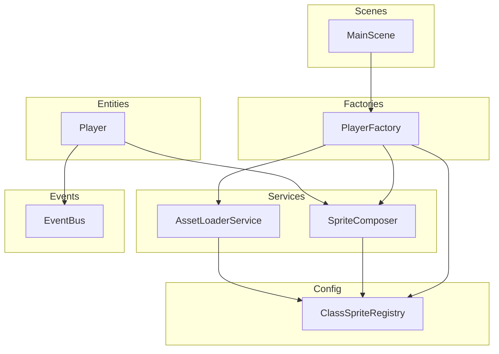

# Design Document: Class-Based Sprites

## Overview

This design implements a data-driven, class-based player sprite system that replaces the current hardcoded knight-only sprite rendering with a configurable architecture supporting five player classes: Caballero (knight), Mago, Espadachín, Gladiador, and Arquero.

The system introduces three new components:
1. **Class_Sprite_Registry** — a static configuration mapping each player class to its equipment asset keys
2. **SpriteComposer** — a service that assembles layered sprites from registry data
3. **PlayerFactory** — a factory that creates fully configured Player entities for any class

The current `Player` entity retains its movement, state, and update loop responsibilities but delegates sprite construction and animation registration to the new components.

### Design Goals

- **Data-driven**: Adding a new class requires only a registry entry and asset files — no code changes to rendering logic
- **Memory-efficient**: Only the active class's assets are loaded at any time
- **Graceful degradation**: Missing layers are skipped, invalid classes fall back to Caballero
- **Runtime switching**: Class changes happen within a single frame with full state preservation

---

## Architecture



### Data Flow

1. **Initialization**: MainScene asks PlayerFactory to create a Player with a given class
2. **Resolution**: PlayerFactory queries ClassSpriteRegistry for asset keys
3. **Loading**: AssetLoaderService loads only the required class assets (if not cached)
4. **Composition**: SpriteComposer creates sprite layers from resolved keys
5. **Runtime switch**: Player.changeClass() triggers SpriteComposer to destroy/rebuild layers

---

## Components and Interfaces

### ClassSpriteRegistry (`src/game/config/ClassSpriteRegistry.ts`)

A static configuration object that maps each `PlayerClass` to its equipment layer asset keys.

```typescript
/** The five supported player classes */
export enum PlayerClass {
  Caballero = "knight",
  Mago = "mago",
  Espadachin = "espadachin",
  Gladiador = "gladiador",
  Arquero = "arquero",
}

/** Sprite layers that vary by class */
export type EquipmentLayer = "feet" | "legs" | "torso" | "weapon" | "shield" | "helmet";

/** Configuration for a single class's sprite layers */
export interface ClassSpriteConfig {
  /** Class identifier used in asset key prefixes */
  classId: PlayerClass;
  /** Asset keys for each equipment layer, null if layer is absent */
  layers: Record<EquipmentLayer, string | null>;
  /** Helmet type: "directional" uses 4 separate images, "spritesheet" uses a single sheet */
  helmetType: "directional" | "spritesheet";
}

/** The shared body asset key used by ALL classes */
export const SHARED_BODY_KEY = "knight-body";

/** Frame dimensions for all spritesheets */
export const FRAME_WIDTH = 64;
export const FRAME_HEIGHT = 64;

/** The full registry mapping */
export const CLASS_SPRITE_REGISTRY: Record<PlayerClass, ClassSpriteConfig> = {
  [PlayerClass.Caballero]: {
    classId: PlayerClass.Caballero,
    layers: {
      feet: "knight-feet",
      legs: "knight-legs",
      torso: "knight-torso",
      weapon: "knight-weapon",
      shield: "knight-shield",
      helmet: "knight-helmet",
    },
    helmetType: "directional",
  },
  [PlayerClass.Mago]: {
    classId: PlayerClass.Mago,
    layers: {
      feet: "mago-feet",
      legs: "mago-legs",
      torso: "mago-torso",
      weapon: "mago-weapon",
      shield: null,
      helmet: "mago-helmet",
    },
    helmetType: "spritesheet",
  },
  [PlayerClass.Espadachin]: {
    classId: PlayerClass.Espadachin,
    layers: {
      feet: "espadachin-feet",
      legs: "espadachin-legs",
      torso: "espadachin-torso",
      weapon: "espadachin-weapon",
      shield: null,
      helmet: null,
    },
    helmetType: "spritesheet", // N/A — no helmet
  },
  [PlayerClass.Gladiador]: {
    classId: PlayerClass.Gladiador,
    layers: {
      feet: "gladiador-feet",
      legs: "gladiador-legs",
      torso: "gladiador-torso",
      weapon: "gladiador-weapon",
      shield: null,
      helmet: "gladiador-helmet",
    },
    helmetType: "directional",
  },
  [PlayerClass.Arquero]: {
    classId: PlayerClass.Arquero,
    layers: {
      feet: "arquero-feet",
      legs: "arquero-legs",
      torso: "arquero-torso",
      weapon: "arquero-weapon",
      shield: null,
      helmet: "arquero-helmet",
    },
    helmetType: "spritesheet",
  },
};
```

### SpriteComposer (`src/game/services/SpriteComposer.ts`)

Service responsible for creating, synchronizing, and destroying layered sprites.

```typescript
export interface ComposedSprites {
  body: Phaser.Physics.Arcade.Sprite;
  feet: Phaser.GameObjects.Sprite | null;
  legs: Phaser.GameObjects.Sprite | null;
  torso: Phaser.GameObjects.Sprite | null;
  weapon: Phaser.GameObjects.Sprite | null;
  shield: Phaser.GameObjects.Sprite | null;
  helmet: Phaser.GameObjects.Sprite | null;
}

export interface SpriteComposer {
  /** Creates all sprite layers for the given class at position (x, y) */
  compose(scene: Phaser.Scene, x: number, y: number, config: ClassSpriteConfig): ComposedSprites;

  /** Destroys all equipment layers (not body) */
  destroyEquipmentLayers(sprites: ComposedSprites): void;

  /** Registers animations for a specific class */
  registerAnimations(scene: Phaser.Scene, config: ClassSpriteConfig): void;

  /** Updates all layer positions relative to body */
  syncPositions(sprites: ComposedSprites, direction: PlayerDirection): void;

  /** Plays the correct animation on all layers */
  playAnimation(sprites: ComposedSprites, config: ClassSpriteConfig, state: PlayerState, direction: PlayerDirection): void;
}
```

### AssetLoaderService (`src/game/services/AssetLoaderService.ts`)

Service responsible for loading and caching class-specific assets.

```typescript
export interface AssetLoaderService {
  /** Loads all assets for a given class. Skips if already in texture cache. */
  loadClassAssets(scene: Phaser.Scene, playerClass: PlayerClass): Promise<void>;

  /** Checks if all required assets for a class are loaded */
  areAssetsLoaded(scene: Phaser.Scene, playerClass: PlayerClass): boolean;

  /** Resolves the file path for a specific layer and class */
  resolveAssetPath(playerClass: PlayerClass, layer: EquipmentLayer): string;
}
```

### PlayerFactory (`src/game/factories/PlayerFactory.ts`)

Factory that creates fully configured Player entities.

```typescript
export interface PlayerFactoryOptions {
  scene: Phaser.Scene;
  x: number;
  y: number;
  playerClass?: PlayerClass; // defaults to Caballero
}

export class PlayerFactory {
  create(options: PlayerFactoryOptions): Player;
}
```

### Player Entity (refactored) (`src/game/entities/characters/Player.ts`)

The Player entity is refactored to:
- Accept a `ClassSpriteConfig` instead of hardcoded knight keys
- Delegate sprite creation to SpriteComposer
- Expose a `changeClass(newClass: PlayerClass): void` method
- Emit events via EventBus on class change failures

```typescript
export class Player {
  private currentClass: PlayerClass;
  private sprites: ComposedSprites;
  private config: ClassSpriteConfig;

  constructor(scene: Phaser.Scene, x: number, y: number, config: ClassSpriteConfig);

  /** Changes the player's visual class at runtime */
  changeClass(newClass: PlayerClass): void;

  /** Returns the currently active class */
  getPlayerClass(): PlayerClass;
}
```

### EventBus Extensions (`src/game/events/event-bus.types.ts`)

New event types for class change communication:

```typescript
export type EventBusMap = {
  // ... existing events
  CLASS_CHANGE_FAILED: { reason: "missing_assets" | "invalid_class"; requestedClass: string };
  CLASS_CHANGE_SUCCESS: { previousClass: PlayerClass; newClass: PlayerClass };
};
```

---

## Data Models

### Asset Path Convention

All class assets follow a predictable directory structure:

```
src/assets/characters/classes/{classId}/{layer}/{filename}
```

| Class | classId | Asset Prefix | Actual filenames per layer |
|-------|---------|--------------|---------------------------|
| Caballero | knight | knight- | body/body.png, feet/feet.png, legs/legs.png, torso/torso.png, weapon/weapon.png, shield/shield.png, helmet/e.png+n.png+s.png+w.png |
| Mago | mago | mago- | body/body.png, feet/feets.png, legs/legs.png, torso/torso.png, weapon/weapon.png, helmet/helmet.png |
| Espadachín | espadachin | espadachin- | body/body.png, feet/feets.png, legs/legs.png, torso/torso.png, weapon/weapon.png |
| Gladiador | gladiador | gladiador- | body/body.png, feet/feets.png, legs/legs.png, torso/torso.png, weapon/Walk.png, helmet/e.png+n.png+s.png+w.png |
| Arquero | arquero | arquero- | body/body.png, feet/feets.png, legs/legs.png, torso/torso.png, weapon/bow.png, helmet/helmet.png |

**Note on filename inconsistencies:**
- Knight uses `feet.png`, all other classes use `feets.png`
- Gladiador weapon walk animation is `Walk.png` (PascalCase), attack is `Slash.png`
- Arquero weapon uses `bow.png` for walk (arrow.png for future projectile attacks)
- All classes have an additional `body_attack.png` for future attack animations

### Enemy Asset Path Convention

Enemy sprites use a simpler flat structure:

```
src/assets/characters/classes/{enemyId}/{filename}
```

| Enemy | Directory | Sprite file | Weapon files | Backend ID |
|-------|-----------|-------------|--------------|------------|
| Skeleton | skeleton/ | skeleton.png | weapon/weapon.png | 15 |
| Lobos | lobos/ | wolfs.png | — | 16 |
| Hedgehog | hedgehog/ | hedgehog.png | — | 17 |
| Minotauro | minotauro/ | minotaur.png | weapon/Walk.png, weapon/Slash.png | 18 |

### Animation Key Pattern

All animations follow the pattern: `{classId}-{layer}-{state}-{direction}`

Examples:
- `knight-body-walk-down`
- `mago-torso-idle-left`
- `espadachin-weapon-walk-up`

### Helmet Types

Two helmet rendering modes exist:

| Type | Description | Assets |
|------|-------------|--------|
| `directional` | 4 separate static images (128×128) | `{classId}-helmet-n`, `{classId}-helmet-s`, `{classId}-helmet-e`, `{classId}-helmet-w` |
| `spritesheet` | Single spritesheet with frames | `{classId}-helmet` loaded as spritesheet |

### Layer Depth Map

| Layer | Depth | Notes |
|-------|-------|-------|
| Body | 0 | Physics-enabled, shared across classes |
| Feet | 1 | |
| Legs | 2 | |
| Torso | 3 | |
| Weapon | 4 | Depth adjusts based on direction |
| Shield | 4 | Depth adjusts based on direction |
| Helmet | 5 | |

### Registry Null Semantics

When a layer value is `null` in the registry:
- The SpriteComposer skips creating a sprite for that layer
- No animation is registered for that layer
- Position sync ignores that layer
- Example: Espadachín has `helmet: null` and `shield: null` (swordsman wears no helmet or shield)
- Only Caballero (knight) has a shield

---

## Correctness Properties

*A property is a characteristic or behavior that should hold true across all valid executions of a system — essentially, a formal statement about what the system should do. Properties serve as the bridge between human-readable specifications and machine-verifiable correctness guarantees.*

### Property 1: Registry completeness and type validity

*For any* PlayerClass value in the registry and any EquipmentLayer, the corresponding value must be either a non-empty string (valid asset key) or exactly `null` (layer absent). No entry may be `undefined`, an empty string, or any other type.

**Validates: Requirements 1.1, 1.3**

### Property 2: Shared body key invariant

*For any* two distinct PlayerClass values in the registry, the body spritesheet asset key used during composition must be identical (the shared `SHARED_BODY_KEY` constant).

**Validates: Requirements 1.2, 2.1**

### Property 3: Invalid class fallback

*For any* string value not present in the set of valid PlayerClass enum values, resolving sprite configuration must return the Caballero (knight) class configuration without throwing an error.

**Validates: Requirements 1.4, 5.4, 5.5**

### Property 4: Asset key pattern resolution

*For any* valid PlayerClass and EquipmentLayer with a non-null registry entry, the resolved asset key must match the pattern `{classId}-{layerName}` where classId is the PlayerClass string value and layerName is the EquipmentLayer name.

**Validates: Requirements 3.1, 4.3**

### Property 5: Depth ordering invariant

*For any* PlayerClass, after sprite composition, the depth values assigned to layers must satisfy: body(0) < feet(1) < legs(2) < torso(3) ≤ weapon(4) = shield(4) < helmet(5).

**Validates: Requirements 3.2**

### Property 6: Position synchronization

*For any* body position (x, y) and facing direction, all non-null equipment layer sprites must have their position set to a deterministic offset from (x, y) based on the direction. The offset function must be pure (same input always produces same output).

**Validates: Requirements 3.3**

### Property 7: Animation key consistency

*For any* valid (PlayerClass, EquipmentLayer, PlayerState, PlayerDirection) tuple where the layer is non-null, the animation key played must equal `{classId}-{layer}-{state}-{direction}`.

**Validates: Requirements 3.4, 6.2**

### Property 8: Graceful degradation for null layers

*For any* ClassSpriteConfig where one or more layers are `null`, the SpriteComposer must produce a ComposedSprites object where the corresponding layer field is `null` and no sprite is created or rendered for that layer. The remaining non-null layers must render correctly.

**Validates: Requirements 3.5, 4.4**

### Property 9: Animation registration completeness

*For any* valid PlayerClass, after calling registerAnimations, the Phaser animation manager must contain exactly `N × 2 × 4` animation keys for that class, where N is the number of non-null equipment layers plus 1 (body). Each key follows the pattern `{classId}-{layer}-{state}-{direction}`, walk animations have frameRate=8 and repeat=-1, idle animations have frameRate=1 and repeat=0.

**Validates: Requirements 6.1, 6.3**

### Property 10: Animation and asset loading idempotency

*For any* PlayerClass, calling registerAnimations or loadClassAssets multiple times must produce the same result as calling it once. No duplicate animations are created, no duplicate load requests are made.

**Validates: Requirements 6.4, 4.5**

### Property 11: Class switch replaces textures

*For any* (oldClass, newClass) pair where both are valid and assets are loaded, after a class change the active texture keys on all equipment sprites must correspond to the newClass configuration from the registry.

**Validates: Requirements 7.1**

### Property 12: Class switch preserves state

*For any* (x, y) position and PlayerDirection, after a successful class change the Player's world position must remain (x, y) and facing direction must remain unchanged.

**Validates: Requirements 7.2**

### Property 13: Failed class change retains state and emits error

*For any* class change request where either the target class is invalid (not in registry) or assets are not loaded, the Sprite_Composer must leave all current sprites unchanged and an error event must be emitted via the EventBus with the appropriate reason.

**Validates: Requirements 7.5, 7.6**

### Property 14: Same-class change is a no-op

*For any* Player with active PlayerClass C, requesting a class change to C must not destroy sprites, not create new sprites, and not trigger any animation change.

**Validates: Requirements 7.7**

---

## Error Handling

### Missing Assets at Load Time

- The AssetLoaderService logs a warning: `[AssetLoader] Missing asset for ${playerClass}/${layer}: ${path}`
- The layer is marked as `null` in the composed sprites
- Gameplay continues with remaining layers

### Invalid PlayerClass at Factory

- The PlayerFactory logs: `[PlayerFactory] Invalid class "${value}", falling back to Caballero`
- Returns a Player configured with Caballero assets

### Runtime Class Change Failures

| Scenario | Behavior |
|----------|----------|
| Assets not loaded | Retain current sprites, emit `CLASS_CHANGE_FAILED` with reason `"missing_assets"` |
| Invalid class string | Retain current sprites, emit `CLASS_CHANGE_FAILED` with reason `"invalid_class"` |
| Same class requested | No-op, no event emitted |

### Texture Cache Miss During Composition

- If `scene.textures.exists(key)` returns false for a non-null layer, that layer is treated as null
- A warning is logged
- Other layers proceed normally

---

## Testing Strategy

### Property-Based Testing

This feature is well-suited for property-based testing because:
- The registry is a data structure with clear structural invariants
- Asset key resolution is a pure function of (class, layer) inputs
- Animation key generation is a pure function of (class, layer, state, direction)
- Depth assignment is deterministic
- Class change state preservation is a pure state transformation

**Library**: [fast-check](https://github.com/dubzzz/fast-check) (TypeScript property-based testing library)

**Configuration**: Each property test runs a minimum of 100 iterations.

**Tag format**: Each test is tagged with `Feature: class-based-sprites, Property {N}: {description}`

### Unit Tests

Unit tests cover specific examples and edge cases:
- Espadachín class has null helmet and shield (specific known configuration)
- Only Caballero has shield (all others null)
- Helmet directional switching for knight and gladiador (4 directional images)
- Helmet spritesheet rendering for mago and arquero (single spritesheet)
- Default factory behavior (no class specified → Caballero)
- EventBus emission on failed class change

### Integration Tests

Integration tests verify Phaser runtime behavior:
- Full Player creation through factory in a test scene
- Asset preloading completes without errors for each class
- Runtime class switch with pre-loaded assets
- Camera follow continues after class switch
- Physics body remains functional after class switch

### Test Organization

```
src/game/__tests__/
├── config/
│   └── ClassSpriteRegistry.property.test.ts
├── services/
│   ├── SpriteComposer.property.test.ts
│   └── AssetLoaderService.test.ts
├── factories/
│   └── PlayerFactory.property.test.ts
└── entities/
    └── Player.classChange.test.ts
```
