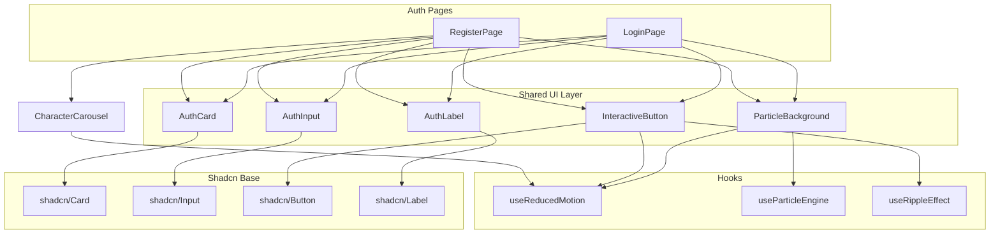

# Design Document: Enhanced Auth UI

## Overview

This design describes the visual redesign of the Revenant Login and Register pages to deliver a Dark Souls-inspired medieval fantasy RPG experience. The enhancement replaces current inline Tailwind styling with a structured component architecture built on shadcn/ui (Nova preset), adds an animated particle background system, introduces interactive button effects, and establishes a two-column register layout with an enlarged character carousel.

The implementation stays entirely within the React application layer. No Phaser code or gameplay logic is involved. All existing authentication logic (react-hook-form + zod validation, AuthenticationService, auth-store) remains unchanged — this is a presentation-layer refactoring.

### Key Design Decisions

1. **Canvas-based particle system** — Uses an HTML `<canvas>` element for particle rendering rather than CSS animations, providing better performance control and enabling precise particle physics (velocity, oscillation, opacity cycling).
2. **shadcn/ui as base layer** — Card, Input, Button, and Label components provide accessible, composable foundations. Custom Revenant theming is applied through Tailwind class overrides and CSS variables, not by forking shadcn internals.
3. **CSS custom properties for Revenant tokens** — Adds `--revenant-primary`, `--revenant-secondary`, `--revenant-accent`, `--revenant-highlight` tokens mapped to the design system hex values, enabling consistent theming across all new components.
4. **Reduced-motion first** — All animations check `prefers-reduced-motion` via a shared hook (`useReducedMotion`). When active, particles render statically, buttons use simple opacity changes, and carousel transitions are instant.

---

## Architecture



### Layer Breakdown

| Layer | Responsibility |
|-------|---------------|
| Page Components | Compose layout, wire form logic, render auth-specific structure |
| Shared UI Layer | Themed wrappers around shadcn base components with Revenant styling |
| Hooks | Encapsulate animation logic, motion preferences, and canvas management |
| shadcn Base | Accessible, unstyled component primitives |

---

## Components and Interfaces

### ParticleBackground

A full-viewport canvas-based particle renderer that creates the ash/ember atmosphere.

```typescript
interface ParticleBackgroundProps {
  particleCount?: number;       // Default: 60 (range 40-80)
  colors?: string[];            // Default: ['#412D15', '#E1DCC9']
  opacityRange?: [number, number]; // Default: [0.3, 0.6]
  speedRange?: [number, number];   // px/sec, Default: [10, 30]
  oscillationMax?: number;      // px, Default: 5
}

interface Particle {
  x: number;
  y: number;
  size: number;
  color: string;
  opacity: number;
  speed: number;
  oscillationOffset: number;
  oscillationSpeed: number;
}
```

**Behavior:**
- Renders a `<canvas>` element with `position: fixed`, `inset: 0`, `z-index: 0`, `pointer-events: none`
- Initializes particles with random positions, sizes (1–4px), and properties within configured ranges
- Animation loop uses `requestAnimationFrame` with delta-time accumulation for frame-rate-independent movement
- Particles move upward; when exiting the top, they respawn at the bottom with new random x-position
- When `prefers-reduced-motion` is active, particles render once in initial positions with no animation loop

### InteractiveButton

A shadcn/ui Button wrapper with glow, scale, and ripple effects.

```typescript
interface InteractiveButtonProps extends React.ComponentProps<typeof Button> {
  glowColor?: string;       // Default: '#E1DCC9'
  glowOpacity?: number;     // Default: 0.4
  glowSpread?: number;      // px, Default: 6
  scaleOnPress?: number;    // Default: 0.96
  rippleDuration?: number;  // ms, Default: 400
}

interface RippleState {
  x: number;
  y: number;
  id: number;
  startTime: number;
}
```

**Behavior:**
- Hover: Applies `box-shadow` with configured glow color/opacity/spread
- Press (mousedown/touchstart): Scales to `scaleOnPress` with 100ms transition
- Release (mouseup/touchend): Creates a radial ripple `<span>` element at the press coordinates, which scales outward and fades over `rippleDuration`ms
- Reduced motion: Only applies a subtle background color change on hover (Highlight at 10% opacity), no glow/scale/ripple

### AuthCard

A themed shadcn/ui Card for form containers.

```typescript
interface AuthCardProps {
  children: React.ReactNode;
  className?: string;
  maxWidth?: 'sm' | 'md' | 'lg' | 'xl'; // maps to max-w-md, max-w-lg, etc.
}
```

**Styling:** Secondary (#1F150C) background, Accent (#412D15) border, inset box-shadow with Primary at 0.5 opacity, min blur 8px.

### AuthInput

A themed shadcn/ui Input component.

```typescript
interface AuthInputProps extends React.ComponentProps<typeof Input> {
  // Inherits all shadcn/ui Input props
}
```

**Styling:** Primary (#000000) background, Accent (#412D15) border, Highlight (#E1DCC9) text, focus ring in Highlight color.

### AuthLabel

A themed shadcn/ui Label component.

```typescript
interface AuthLabelProps extends React.ComponentProps<typeof Label> {
  // Inherits all shadcn/ui Label props
}
```

**Styling:** Highlight (#E1DCC9) text color, font-weight 500 (Montserrat).

### Enhanced CharacterClassCarousel

Extends the existing `CharacterClassCarousel` with larger images and ambient glow.

```typescript
interface EnhancedCarouselProps extends CarouselProps {
  imageSize?: 'sm' | 'lg'; // 'lg' = 256px on desktop, 'sm' = 128px on mobile
}
```

**Changes from current:**
- Character image container: 256x256px on desktop (>768px), 128x128px on mobile (≤768px) — up from current 160x160px
- Ambient glow: radial gradient behind active image using Highlight at 20% opacity
- Class name displayed in `font-title` (Montserrat Alternates) at min 20px
- Slide+fade transition: 300ms (within 250–400ms spec)
- Reduced motion: Instant switch (<50ms) with no animation

### Two-Column Register Layout

```typescript
// Layout structure (within RegisterPage)
// Desktop (≥768px): flex-row, gap-8 (32px)
//   Left column: 45% width — form inputs
//   Right column: 55% width — character carousel (vertically centered)
// Mobile (<768px): flex-col, form stacked above carousel
// Max container width: 960px, centered
```

---

## Data Models

No new data models are introduced. The existing authentication types remain:

```typescript
// Existing — unchanged
type LoginFormData = { username: string; password: string };
type RegisterFormData = {
  username: string;
  email: string;
  password: string;
  confirmPassword: string;
  playerType: 'CABALLERO' | 'MAGO' | 'ARQUERO' | 'GLADIADOR' | 'ESPADACHIN';
};
```

The particle system uses a local `Particle[]` state array managed within the `useParticleEngine` hook — no persistent storage or API interaction.

---

## Correctness Properties

### Property 1: Particle count remains within configured bounds

**Description:** The particle engine must always maintain between `particleCount * 0.8` and `particleCount` active particles (accounting for dynamic reduction under low frame rates). No frame shall render more particles than the configured maximum or fewer than 80% of the configured count (unless the canvas context is unavailable).

**Validates: Requirements 1.1, 1.6**

**Validation:** Example-based unit test — initialize `useParticleEngine` with `particleCount=60`, verify array length stays within [48, 60] after initialization and after simulated frame-rate reduction.

### Property 2: Interactive elements exclusively receive Highlight color

**Description:** The Highlight color (#E1DCC9) must only be applied to interactive elements (buttons, links, focusable inputs) and never to non-interactive text, backgrounds, or decorative elements. This preserves visual hierarchy and accessibility.

**Validates: Requirements 6.5, 6.6**

**Validation:** Static analysis / DOM inspection test — query all elements with Highlight color applied and verify each has an interactive role or is focusable.

### Property 3: Reduced motion disables all continuous animations

**Description:** When `prefers-reduced-motion: reduce` is active, no component shall run a `requestAnimationFrame` loop, CSS transition longer than 50ms, or opacity/transform animation. Particles render statically, buttons use instant state changes, and carousel switches are immediate.

**Validates: Requirements 1.7, 2.5, 4.6**

**Validation:** Example-based unit test — enable reduced motion mock, render each animated component, verify no `requestAnimationFrame` calls and no CSS animation/transition properties are applied.

---

## Error Handling

| Scenario | Handling |
|----------|----------|
| Canvas context unavailable | Fall back to no-particle rendering; log warning to console |
| Character image fails to load | Existing fallback silhouette placeholder preserved |
| shadcn/ui component import failure | Build-time TypeScript error; caught during `tsc -b` |
| Animation frame drops below 30fps | Particle engine reduces `particleCount` by 20% dynamically |
| Form validation errors | Unchanged — react-hook-form + zod displays inline errors via `aria-invalid` and `role="alert"` |

---

## Testing Strategy

### Why Property-Based Testing Does NOT Apply

This feature is a **UI rendering and styling enhancement**. The acceptance criteria describe:
- Visual effects (particle animations, glows, ripples)
- Responsive layouts (column widths, breakpoints)
- CSS styling (colors, shadows, opacity values)
- Animation timing and motion preferences

These are UI presentation concerns. There are no pure functions with meaningful input variation, no data transformations, no serialization, and no business logic to exercise with generated inputs. PBT would not provide value here.

### Recommended Testing Approach

**Unit Tests (example-based):**
- `useReducedMotion` hook returns correct boolean based on matchMedia mock
- `useParticleEngine` initializes correct number of particles within bounds
- `InteractiveButton` renders ripple element on click at correct coordinates
- `ParticleBackground` does not start animation loop when reduced motion is active
- `AuthCard`, `AuthInput`, `AuthLabel` render with correct Revenant theme classes
- Two-column layout applies `flex-row` on desktop and `flex-col` on mobile (via container query or responsive classes)

**Integration Tests:**
- Login page renders with `ParticleBackground`, `AuthCard`, and `InteractiveButton` composed correctly
- Register page renders two-column layout with carousel at correct proportions
- Form submission still works end-to-end after component replacement (react-hook-form integration preserved)
- All `aria-invalid`, `aria-describedby`, and `role="alert"` attributes present after refactoring

**Visual Regression Tests:**
- Snapshot tests for Login and Register pages at desktop (1280px) and mobile (375px) viewports
- Visual diff on button hover/press states
- Carousel transition screenshot comparison

**Accessibility Tests:**
- Verify 4.5:1 contrast ratio for all text/background combinations using automated axe checks
- Ensure no DaisyUI classes remain (static analysis / grep check in CI)
- Keyboard navigation remains functional for carousel and form elements

**Performance Tests (manual/lighthouse):**
- Verify canvas particle system maintains ≥30fps on target hardware
- Lighthouse performance score does not degrade below current baseline
