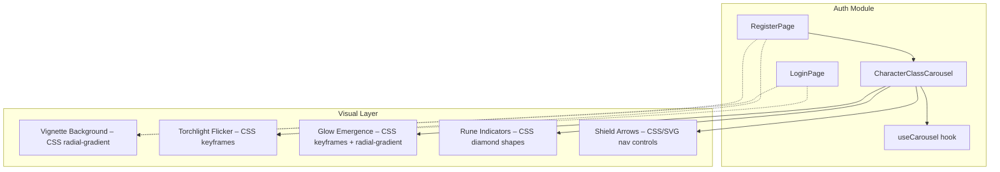

# Design Document: Login & Register UI Improvement

## Overview

This design defines the technical and visual approach for the Login and Register pages of **Revenant** — a medieval fantasy RPG where players become undead warriors fighting through a dark world of knights, mages, and gladiators.

The page's single job: **immerse the player in the game's atmosphere before they even enter.**

The design applies three principles from the frontend-design methodology:
1. **The hero is a thesis** — the Character Class Carousel IS the page's thesis on Register. On Login, the title itself is the atmospheric anchor.
2. **Spend boldness in one place** — the carousel's "emergence from darkness" effect is the ONE signature element. Everything else stays quiet and disciplined.
3. **Typography carries personality** — `font-hand` (Edu VIC WA NT Hand) for atmospheric whispers, `font-title` (Montserrat Alternates) for the game title, `font-sans` (Montserrat) for everything functional.

One added dependency: `react-icons` for thematic medieval iconography (Game Icons collection). CSS transitions only. Four-color palette enforced.

---

## Architecture

The feature touches only the React authentication layer (`src/auth/`). No changes to Phaser.



### Key Architectural Decisions

| Decision | Rationale |
|----------|-----------|
| Carousel as standalone component in `src/auth/components/` | Specific to registration; keeps auth module cohesion high. |
| Custom hook `useCarousel` for carousel state | Extracts navigation logic (index, direction, animation lock) from presentation per SRP. |
| CSS transitions + keyframes only | No animation libraries. Respects `prefers-reduced-motion`. Tailwind-first approach. |
| `react-icons` for medieval iconography | Provides the Game Icons (`Gi`) collection with sword, shield, and medieval-themed icons. Tree-shakeable — only imported icons ship in the bundle. |
| Vignette and glow via CSS gradients | Pure CSS, no image assets, no performance cost. Uses existing palette colors only. |
| Torchlight flicker via CSS keyframes | Subtle opacity oscillation on title. Disabled entirely with `prefers-reduced-motion`. |
| Shield/sword arrows via `react-icons/gi` | Uses `GiPointySword` or similar Game Icons for navigation. Thematically rich without custom SVG maintenance. |

---

## Visual Design Plan

### Design Thesis

The login/register experience should feel like approaching an ancient gateway — darkness at the edges, warmth at the center, and the promise of adventure within. The player is not filling out a form; they are entering a world.

### Signature Element: Character Class Emergence

The carousel is THE bold moment. When a character class is displayed:
- The character image sits on a pure black background
- Behind the character: a subtle radial glow using `highlight` color at very low opacity (~8-12%), creating an "emerging from darkness" effect
- On card transition: the incoming character fades/slides in while the glow pulses once (a single CSS animation cycle, ~600ms)
- The effect suggests the character is materializing from shadow — choosing your destiny, not picking from a list

Everything else on the page stays quiet to let this moment breathe.

### Atmospheric Background: Vignette

Both pages share a CSS-only depth effect:
- Base: `primary` (#000000) full background
- Radial gradient from center: `secondary` (#1F150C) at ~15% opacity fading to transparent
- Creates a subtle warm center with darker edges
- Implementation: `background: radial-gradient(ellipse at center, rgba(31,21,12,0.15) 0%, transparent 70%)`

### Typography Plan

| Element | Font | Weight | Role |
|---------|------|--------|------|
| "Revenant" title | `font-title` (Montserrat Alternates) | 700 | Game identity |
| Atmospheric subtitles ("Enter the realm", "Choose your destiny") | `font-hand` (Edu VIC WA NT Hand) | 400 | Parchment whisper — as if scrawled by a traveler |
| Form labels, buttons, body | `font-sans` (Montserrat) | 400/600/700 | Functional clarity |

The `font-hand` subtitle is the only place handwriting appears — used with restraint, it creates contrast against the geometric precision of the rest.

### Torchlight Title Flicker

A very subtle CSS keyframe animation on the title text:
```css
@keyframes torchlight {
  0%, 100% { opacity: 1; }
  50% { opacity: 0.92; }
  75% { opacity: 0.97; }
}
```
- Applied to the "Revenant" title only
- Duration: 3-4s, infinite loop
- Effect is barely perceptible — simulates distant torchlight illuminating an inscription
- Completely disabled via `prefers-reduced-motion: reduce`

### Form Card: Enchanted Artifact

The card container gets a subtle inner border glow:
- `box-shadow: inset 0 0 30px rgba(225,220,201,0.03), 0 25px 50px rgba(0,0,0,0.5)`
- The inner glow uses `highlight` at ~3% opacity — almost invisible but creates depth
- Suggests the card is an enchanted scroll or ancient artifact
- Border: 1px solid `accent` (#412D15) at 40% opacity

### Navigation: Medieval Icon Arrows

Replace generic chevrons with `react-icons/gi` (Game Icons) components:
- Use `GiPointySword` rotated -90° for "next" and 90° for "previous" (or `GiArrowDunk`, `GiBroadsword` — choose the most readable at small sizes)
- Alternative: `GiShield` as the button container shape with a directional arrow inside
- Color: `highlight` at 60% opacity, transitioning to full opacity on hover
- Size: 24px icon within a 44×44px clickable area (button padding provides the touch target)
- The icon choice should evoke "advance" and "retreat" in a medieval context

### Indicators: Rune Diamonds

Replace dot indicators with small rotated squares (diamonds):
- 8×8px squares rotated 45° via `transform: rotate(45deg)`
- Inactive: `accent` (#412D15) fill
- Active: `highlight` (#E1DCC9) fill with subtle box-shadow glow
- Transition: 200ms ease on background-color and box-shadow

---

## Components and Interfaces

### 1. CharacterClassCarousel

**Location:** `src/auth/components/CharacterClassCarousel.tsx`

```typescript
interface CarouselProps {
  /** Currently selected class value (controlled component) */
  value: string;
  /** Callback when the user navigates to a new class */
  onChange: (playerType: string) => void;
  /** Error message to display below the carousel */
  error?: string;
}
```

**Visual behavior notes:**
- Carousel viewport has `overflow: hidden` and is positioned relative
- Active card sits centered with the radial glow background behind the character image
- Glow is a CSS `::before` pseudo-element on the card: `radial-gradient(circle, rgba(225,220,201,0.1) 0%, transparent 60%)`
- On transition, incoming card has a brief scale-up from 0.95 → 1.0 combined with opacity 0 → 1 (300ms)
- Navigation arrows use `react-icons/gi` Game Icons (e.g., `GiPointySword`) rotated for direction
- Dot indicators are diamond-shaped `<span>` elements
- "Choose your destiny" label above carousel uses `font-hand`
- A small decorative `GiCrossedSwords` icon may appear near the title on both pages for atmospheric flair

### 2. CarouselCard

**Location:** Defined within `CharacterClassCarousel.tsx`

```typescript
interface CarouselCardProps {
  name: string;
  imageSrc: string;
  isActive: boolean;
}
```

**Visual behavior notes:**
- Image displayed at fixed aspect ratio with `object-contain`
- Character name below image in `font-sans` weight 500
- When `isActive`: glow pseudo-element visible, scale at 1.0
- When entering: scale animates from 0.95, opacity from 0
- Placeholder on image error: a silhouette SVG in `accent` color

### 3. useCarousel Hook

**Location:** `src/auth/hooks/useCarousel.ts`

```typescript
interface UseCarouselReturn {
  currentIndex: number;
  direction: "left" | "right" | null;
  isAnimating: boolean;
  goNext: () => void;
  goPrev: () => void;
  goTo: (index: number) => void;
}

function useCarousel(totalItems: number, initialIndex?: number): UseCarouselReturn;
```

**Behavior:**
- Manages circular index (wraps at boundaries using modulo)
- Tracks animation direction for CSS transition class selection
- Locks navigation during animation via `isAnimating` flag (unlocked by `transitionend` event)
- Respects `prefers-reduced-motion`: when active, sets duration to 0ms and releases lock immediately

### 4. Updated RegisterPage

- Replaces `<select>` for `playerType` with `<CharacterClassCarousel>`
- Uses `react-hook-form`'s `Controller` to integrate carousel as controlled field
- Adds `font-hand` subtitle: "Choose your destiny"
- A small `GiCrossedSwords` icon from `react-icons/gi` placed between the title and subtitle as a decorative separator (matching LoginPage)
- Applies vignette background, card glow, and consistent design tokens
- Adds torchlight animation on title

### 5. Updated LoginPage

- Adds vignette background (radial gradient)
- Subtitle "Enter the realm" switched to `font-hand`
- Title receives torchlight flicker animation
- Card gets enchanted artifact styling (inner glow, accent border)
- A small `GiCrossedSwords` icon from `react-icons/gi` placed between the title and subtitle as a decorative separator (highlight color at 40% opacity, ~20px)
- Focus rings and hover transitions verified to spec

---

## Data Models

### Character Class Mapping

```typescript
interface CharacterClass {
  id: string;        // e.g., "CABALLERO"
  label: string;     // e.g., "Caballero"
  imageSrc: string;  // Vite-resolved asset import
}

const CHARACTER_CLASSES: CharacterClass[] = [
  { id: "CABALLERO", label: "Caballero", imageSrc: knightImg },
  { id: "MAGO", label: "Mago", imageSrc: magoImg },
  { id: "ARQUERO", label: "Arquero", imageSrc: arqueroImg },
  { id: "GLADIADOR", label: "Gladiador", imageSrc: gladiadorImg },
  { id: "ESPADACHIN", label: "Espadachín", imageSrc: espadacinImg },
];
```

Assets imported statically via Vite's asset handling for hashed filenames in production.

No backend data model changes — the `playerType` field submitted to the API remains a string enum matching `PLAYER_TYPES`.

### CSS Custom Animations (added to index.css)

```css
@keyframes torchlight {
  0%, 100% { opacity: 1; }
  50% { opacity: 0.92; }
  75% { opacity: 0.97; }
}

@keyframes glow-pulse {
  0% { opacity: 0.06; transform: scale(0.95); }
  50% { opacity: 0.12; transform: scale(1.02); }
  100% { opacity: 0.08; transform: scale(1); }
}

@media (prefers-reduced-motion: reduce) {
  * {
    animation-duration: 0ms !important;
    transition-duration: 0ms !important;
  }
}
```

---

## Correctness Properties

*A property is a characteristic or behavior that should hold true across all valid executions of a system — essentially, a formal statement about what the system should do. Properties serve as the bridge between human-readable specifications and machine-verifiable correctness guarantees.*

### Property 1: Carousel navigation wraps circularly

*For any* sequence of navigation actions (forward or backward, via click or keyboard) on a carousel with K items, the displayed index SHALL always equal the expected circular index (computed via modular arithmetic), ensuring the carousel wraps from the last item back to the first and vice versa.

**Validates: Requirements 3.6, 4.2, 4.3**

### Property 2: Carousel selection equals displayed card

*For any* navigation action (next, previous, or direct index selection), the value reported to the parent form via `onChange` SHALL always correspond to the character class of the currently centered card.

**Validates: Requirements 3.7, 3.9**

### Property 3: Animation lock prevents concurrent transitions

*For any* sequence of rapid navigation inputs during an active animation, the carousel SHALL process exactly one transition at a time — the final displayed card after the animation completes is determined by the single accepted input, not by interleaved or queued inputs.

**Validates: Requirements 5.4**

---

## Error Handling

| Scenario | Handling |
|----------|----------|
| Character image fails to load | `onError` handler on `` replaces `src` with a silhouette SVG placeholder in `accent` color. Card remains navigable. |
| Form validation failure | `react-hook-form` + `zod` surfaces per-field errors. Error messages render below each field with `accent` border styling. Carousel shows its own error message below the component. |
| Submission failure (network/server) | Existing `useAuthError` hook handles API errors. Submit button returns to enabled state within 1s per requirement. |
| Animation interruption (rapid clicks) | `isAnimating` lock prevents navigation until `transitionend` fires. If `transitionend` never fires (e.g., `prefers-reduced-motion`), the lock is released immediately via a 0ms fallback timeout. |
| `prefers-reduced-motion` active | All animations and transitions set to 0ms duration. Torchlight flicker disabled. Carousel card changes are instantaneous. |

---

## Testing Strategy

### Why Property-Based Testing Has Limited Application Here

This feature is primarily **UI rendering, CSS transitions, visual layout, and form interaction feedback**. Most acceptance criteria describe specific pixel values, color tokens, ARIA attributes, and visual states that are best validated with concrete examples.

However, the `useCarousel` hook contains **pure algorithmic logic** (circular index computation, animation locking) that benefits from property-based testing. We apply PBT to those 3 properties while using example-based tests for everything else.

### Test Approach

| Category | Tools | Coverage |
|----------|-------|----------|
| Property tests | Vitest + fast-check | Carousel circular navigation, selection integrity, animation lock |
| Component tests | Vitest + React Testing Library | Rendering, form validation, button states, ARIA attributes |
| Accessibility | axe-core via `@axe-core/react` or `vitest-axe` | ARIA roles, labels, focus management, screen reader announcements |
| Visual verification | Manual | Vignette, torchlight flicker, glow effect, rune indicators |
| Integration | Vitest + RTL | Full form submission flow, carousel ↔ form integration |

### Property-Based Test Configuration

- Library: **fast-check** (already compatible with Vitest)
- Minimum 100 iterations per property test
- Each test tagged with design property reference

Tag format examples:
- `Feature: login-register-ui-improvement, Property 1: Carousel navigation wraps circularly`
- `Feature: login-register-ui-improvement, Property 2: Carousel selection equals displayed card`
- `Feature: login-register-ui-improvement, Property 3: Animation lock prevents concurrent transitions`

### Key Test Cases

**Property Tests (useCarousel hook):**
- For any random sequence of goNext/goPrev calls, index always equals expected mod K
- For any navigation, onChange receives the class at the current circular index
- For any rapid sequence during isAnimating=true, only one transition is accepted

**CharacterClassCarousel (example-based):**
- Renders first class (knight) by default
- Next arrow advances to next class
- Previous arrow wraps from first to last
- Keyboard ArrowRight/ArrowLeft navigates correctly
- Rune diamond indicators reflect current position
- Shield arrow buttons have correct aria-labels
- Navigation locked during animation
- `prefers-reduced-motion` disables animation duration
- Image fallback renders on load error
- ARIA live region announces class changes
- Glow pseudo-element present on active card

**LoginPage / RegisterPage (example-based):**
- Title uses `font-title` with torchlight animation class
- Subtitle uses `font-hand` class
- Vignette background gradient applied
- Card has inner glow box-shadow
- Submit button shows processing label and disabled state during submission
- Submit button restores after response
- Focus ring visible on input focus (2px, highlight color)
- Hover transition applied to submit button (150-300ms)
- Validation errors appear below invalid fields
- Validation errors clear when field becomes valid

**Responsive (example-based):**
- No horizontal overflow at 320px viewport
- Carousel scales appropriately below 640px
- Minimum 14px font size at all viewports

**Accessibility:**
- All interactive elements meet 44×44px touch target
- ARIA role="group" with correct aria-label on carousel
- Screen reader announcements on card change
- Focus indicators visible on keyboard navigation

---
